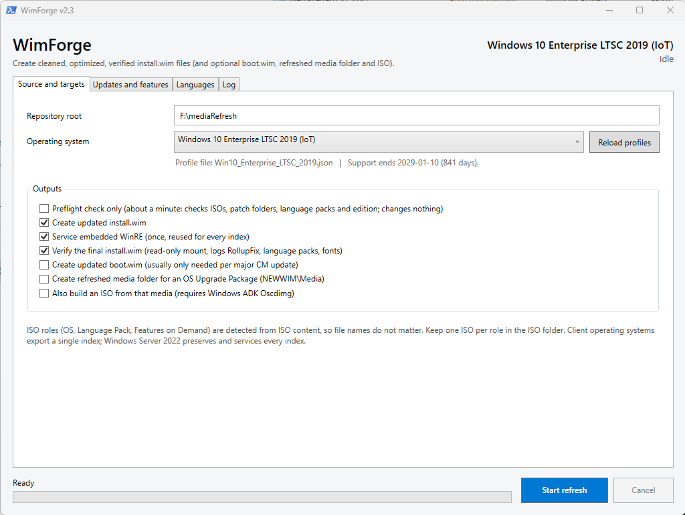

# WimForge

Inspired by other great tools, like WimWizard, WimWitch.
WimForge automates adding cumulative patches, language packs, and Features on Demand to
Windows OS media (Windows 11, Windows 10 LTSC, Windows Server 2022, and
others) as an offline DISM servicing step, ahead of importing the refreshed
images into SCCM/Configuration Manager for deployment.

The tool is a single-file PowerShell 5.1 WPF GUI application: mount an OS ISO
(plus optional Language Pack / Features on Demand ISOs), apply the SSU/LCU/
language packs/.NET CU in Microsoft's documented order, verify the result,
and optionally build a refreshed media folder and ISO for OS Upgrade
Packages. It can also download the current LCU, .NET CU, Safe OS and Setup
Dynamic Updates from the Microsoft Update Catalog (via the MSCatalogLTS
module), with a dry-run preview before anything is downloaded.

## Files

- `MediaRefresh_v2.4.ps1` — the current script and the only one under
  development and test. A complete, standalone script (no shared modules).
- `TODO.md` — the project's living task list: what is being validated now,
  the open decisions, the feature backlog, and a reference summary of what
  v2.4 already contains.
- `testkit/` — a mock-based PowerShell test kit (unit tests, end-to-end
  scenario tests, XAML/parse/lint checks). It tests `MediaRefresh_v2.4.ps1`
  by default; set `$env:MR_SCRIPT` to test another copy. See
  `testkit/README_TESTKIT.md`.
- `MediaRefresh_Review_and_Roadmap.md` — the original code review and
  roadmap that this project's plan grew out of (section 0 has the real-image
  test plan).
- `archive/` — earlier versions (`v2_original`, `v2.1`–`v2.3`) and old notes,
  kept for history only. v2.4 contains everything they had.

## Status

v2.4 is being validated (see `TODO.md` step 2). It passes the mock test kit
(275 checks, on Windows PowerShell 5.1 and 7) and every built-in catalog
rule has been checked against the live Microsoft Update Catalog. One real
image has been serviced so far (Windows 11 24H2, validation gate passed);
the other OSes are still to be run. Treat it as a draft and test on
non-production images first.

## Requirements

Windows PowerShell 5.1, run elevated, on a machine with the DISM module and
enough free disk space per profile (30 GB client / 60 GB Server minimum).
"Download patches..." needs internet access and installs the MSCatalogLTS
module from the PowerShell Gallery on first use.
See `TODO.md` and the in-script header comments for the expected working
folder layout (`ISO`, `LOGS`, `MOUNT`, `OLDWIM`, `NEWWIM`, `PATCHES`, `TEMP`,
`WINPE`, `WINRE`, `WORKING` per OS).
